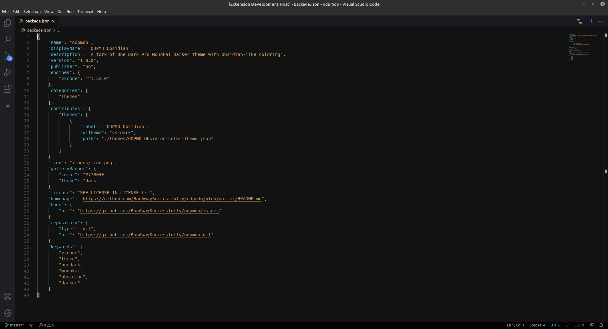
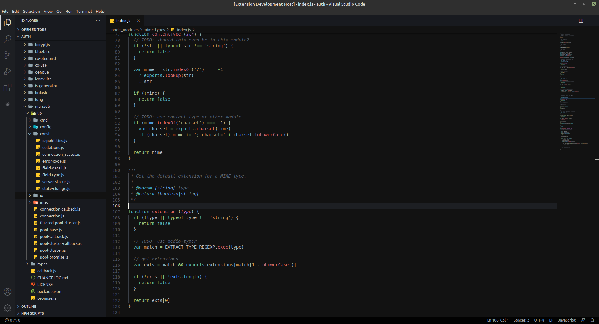

# [ODPMD Obsidian](https://github.com/RanAwaySuccessfully/odpmdo)

A fork of [One Dark Pro Monokai Darker](https://github.com/eserozvataf/vscode-one-dark-pro-monokai-darker), with Obsidian-like code coloring.

**Note:** This theme does not implement bracket pair colorization. If `editor.bracketPairColorization.enabled` is set to `true`, only unexpected brackets will appear with a different color, all other colors will need to be manually overriden through the `workbench.colorCustomizations` setting, with properties from `editorBracketHighlight.foreground1` up to `editorBracketHighlight.foreground6`, for example:

```json
{
    "workbench.colorCustomizations": {
        "editorBracketHighlight.foreground1": "#FFFF00",
        "editorBracketHighlight.foreground2": "#00FF00",
        "editorBracketHighlight.foreground3": "#00FFFF",
        "editorBracketHighlight.foreground4": "#0000FF",
        "editorBracketHighlight.foreground5": "#FF00FF",
        "editorBracketHighlight.foreground6": "#FF0000"
    }
}
```

## Manual Installation
See [releases](https://github.com/RanAwaySuccessfully/odpmdo/releases). Once downloaded, double-click the file OR run the command palette (`Ctrl/Command + Shift + P`) and look for **Extensions: Install from VSIX...**

If you want to build the VSIX package yourself, open a new terminal and run:
```
npx vsce package
```

## Screenshots



## Requirements
* Visual Studio Code (https://code.visualstudio.com/)

## License
Please see the [LICENSE](LICENSE.txt) file.

## Contributing
It is publicly open for any contribution. Bugfixes, new features and extra modules are welcome.

* To contribute to code: Fork the repo, push your changes to your fork, and submit a pull request.
* To report a bug: If something does not work, please report it using [GitHub Issues](https://github.com/RanAwaySuccessfully/odpmdo/issues).